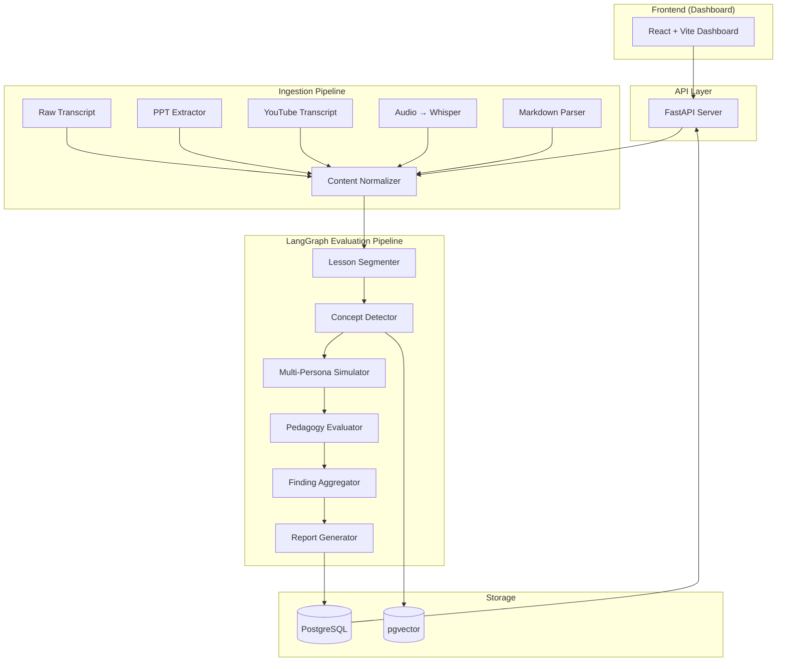
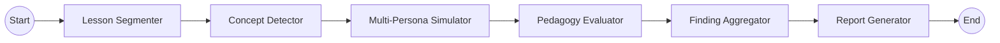
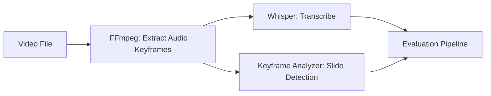

# Teacher Feedback Agent — Implementation Plan

An AI-native pedagogical evaluation system that simulates diverse student personas and provides structured, evidence-based feedback on teaching quality.

---

## High-Level Architecture



---

## Proposed Changes

### Phase 1 — Project Scaffolding & Core Backend

#### [NEW] Project Root Configuration

| File | Purpose |
|---|---|
| `pyproject.toml` | Python project metadata, dependencies, scripts |
| `docker-compose.yml` | PostgreSQL + pgvector + API + Dashboard |
| `Dockerfile` | Multi-stage build for the Python backend |
| `Makefile` | Developer convenience commands (`make dev`, `make test`, etc.) |
| `.env.example` | Template for environment variables |
| `README.md` | Architecture diagram, setup guide, example outputs |
| `.gitignore` | Standard Python/Node ignores |

#### [NEW] `backend/app/main.py`
FastAPI application entry point with:
- CORS middleware
- Lifespan events for DB pool init/teardown
- Router mounting for all API modules

#### [NEW] `backend/app/core/config.py`
Pydantic `BaseSettings` for:
- `DATABASE_URL`, `OPENAI_API_KEY`, `OPENAI_MODEL`
- `DEFAULT_RUBRIC_MODE` (deterministic vs. flexible)
- `MAX_UPLOAD_SIZE_MB`, `ALLOWED_EXTENSIONS`

#### [NEW] `backend/app/core/database.py`
- Async SQLAlchemy engine + session factory
- pgvector extension initialization
- Connection pool management

---

### Phase 2 — Ingestion Pipeline

#### [NEW] `backend/app/ingestion/` package

| File | Responsibility |
|---|---|
| `router.py` | `/api/v1/ingest` endpoints (upload file, submit URL, paste text) |
| `schemas.py` | Pydantic models: `IngestRequest`, `IngestResponse`, `ContentType` enum |
| `base.py` | `BaseIngester` abstract class |
| `transcript.py` | Raw transcript / markdown passthrough |
| `pptx_extractor.py` | `python-pptx` slide text + speaker notes extraction |
| `youtube.py` | `youtube-transcript-api` with fallback to `yt-dlp` + Whisper |
| `audio.py` | Audio file → Whisper transcription (via OpenAI API or local) |
| `normalizer.py` | Unified `LessonContent` output: timestamped segments, metadata |

**Key design decisions:**
- Every ingester produces a common `LessonContent` Pydantic model
- Timestamps are preserved when available (YouTube, audio) for attention-drop heatmaps
- PPT extraction includes slide numbers for segment anchoring

---

### Phase 3 — LangGraph Evaluation Pipeline

This is the core of the system. Each node in the graph is a discrete, testable unit.



#### [NEW] `backend/app/pipeline/state.py`
The shared `TypedDict` state flowing through the graph:

```python
class PipelineState(TypedDict):
    # Input
    lesson_content: LessonContent
    selected_personas: list[str]
    rubric_config: RubricConfig
    
    # Segmentation
    segments: list[LessonSegment]
    
    # Concept Detection
    concepts: list[DetectedConcept]
    concept_graph: dict  # adjacency list of concept dependencies
    
    # Persona Simulations
    persona_results: dict[str, PersonaSimulation]
    
    # Pedagogy Evaluation
    pedagogy_scores: PedagogyScores
    bloom_distribution: BloomDistribution
    
    # Aggregation
    confusion_hotspots: list[ConfusionHotspot]
    attention_drops: list[AttentionDrop]
    
    # Final Output
    teacher_report: TeacherReport
    metrics_json: dict
    simulated_questions: list[SimulatedQuestion]
```

#### [NEW] `backend/app/pipeline/nodes/segmenter.py`
- Splits lesson content into coherent topical chunks (3-7 min segments for timed content, ~500 token chunks for text-only)
- Preserves original span references for evidence linking
- Tags each segment with topic label and position metadata

#### [NEW] `backend/app/pipeline/nodes/concept_detector.py`
- Extracts key concepts from each segment
- Builds a concept dependency graph (prerequisite → concept)
- Identifies scaffolding gaps (concept used without prerequisite being taught)
- Stores concept embeddings in pgvector for cross-lesson analysis

#### [NEW] `backend/app/pipeline/nodes/persona_simulator.py`
Seven student personas, each with a distinct system prompt:

| Persona | Key Behavior | Focus Areas |
|---|---|---|
| **Weak Student** | Struggles with abstraction, needs concrete examples | Missing examples, jargon without definition |
| **Average Student** | Follows linearly, loses track with jumps | Pacing, logical flow breaks |
| **High Performer** | Bored by repetition, seeks depth | Lack of challenge, missing "why" |
| **Exam-Focused** | Wants testable takeaways | Missing summaries, no practice problems |
| **Low-Attention** | Disengages after ~7 minutes without stimulus | Monotony, lack of interaction points |
| **First-Time Learner** | Zero prior knowledge assumed | Assumed prerequisite knowledge, acronyms |
| **ESL Student** | Struggles with idioms, complex syntax, speed | Colloquialisms, dense sentences, fast pace |

Each persona produces:
- `confusion_points`: list of `(segment_id, reason, severity)`
- `probable_questions`: natural-language questions the student would ask
- `attention_score_per_segment`: 0.0–1.0
- `overload_moments`: segments where cognitive load exceeds capacity
- `clarity_score`: overall 0–10
- `misconceptions`: likely misunderstandings that could form

> [!IMPORTANT]
> Each persona runs as a **separate LLM call** with its own system prompt. This is intentional — running them in parallel gives diverse, independent perspectives. A single combined prompt would collapse the diversity.

#### [NEW] `backend/app/pipeline/nodes/pedagogy_evaluator.py`
Rubric-based evaluation engine. Scores each dimension using an explicit rubric:

| Dimension | Scale | Rubric Anchors |
|---|---|---|
| Clarity | 0–10 | 0: incomprehensible, 5: mostly clear with gaps, 10: crystal clear |
| Pacing | 0–10 | 0: wildly rushed/slow, 5: uneven, 10: perfectly calibrated |
| Engagement | 0–10 | 0: purely monotone lecture, 5: occasional interaction, 10: highly interactive |
| Scaffolding | 0–10 | 0: no build-up, 5: partial, 10: expertly layered |
| Retrieval Practice | 0–10 | 0: none used, 5: some recall prompts, 10: systematic retrieval |
| Interleaving | 0–10 | 0: purely blocked, 5: some mixing, 10: strategic interleaving |
| Concept Reinforcement | 0–10 | 0: mentioned once, 5: revisited, 10: spaced + varied repetition |
| Cognitive Load | 0–10 | 0: overwhelming, 5: occasionally high, 10: well-managed |
| Misconception Handling | 0–10 | 0: none addressed, 5: some preempted, 10: systematically addressed |
| Bloom Depth | 0–10 | 0: only remember, 5: up to apply, 10: full taxonomy coverage |
| Formative Assessment | 0–10 | 0: none present, 5: occasional checks, 10: embedded throughout |

**Each score includes:**
- `score`: float
- `rationale`: 2-3 sentence explanation
- `evidence_spans`: list of quoted segments from the lesson
- `confidence`: 0.0–1.0 (how much evidence was available)

> [!IMPORTANT]
> **Hallucination-safe scoring**: The evaluator operates in "deterministic rubric mode" by default — each score must cite a specific evidence span. If no evidence exists for a dimension, the score is `null` with a `confidence: 0.0` rather than a fabricated score.

#### [NEW] `backend/app/pipeline/nodes/aggregator.py`
- Merges persona results to identify consensus confusion points
- Ranks confusion hotspots by cross-persona severity
- Computes attention-drop timeline (weighted average across personas)
- Generates the Bloom's taxonomy distribution from concept + segment analysis
- Produces the `PedagogyMetrics` JSON

#### [NEW] `backend/app/pipeline/nodes/report_generator.py`
Generates the final structured report with these sections:
1. **Overall Summary** — 3-5 sentence executive summary
2. **Strengths** — what worked well, with evidence
3. **Weaknesses** — what didn't, with predicted student impact + suggested fix
4. **Confusion Hotspots** — ranked list with segment references
5. **Attention Drop Predictions** — timeline with causes
6. **Suggested Improvements** — actionable, specific recommendations
7. **Missing Examples** — concepts that need concrete illustrations
8. **Overloaded Explanations** — segments with excessive cognitive load
9. **Retrieval Checkpoints** — where to insert recall questions

Each weakness/criticism includes the required triad:
- **Why it matters** (learning science justification)
- **Predicted student impact** (persona-specific)
- **Suggested fix** (concrete, actionable)

#### [NEW] `backend/app/pipeline/graph.py`
Assembles the LangGraph `StateGraph`:
```python
builder = StateGraph(PipelineState)
builder.add_node("segment", segment_node)
builder.add_node("detect_concepts", concept_detector_node)
builder.add_node("simulate_personas", persona_simulator_node)
builder.add_node("evaluate_pedagogy", pedagogy_evaluator_node)
builder.add_node("aggregate", aggregator_node)
builder.add_node("generate_report", report_generator_node)

builder.add_edge(START, "segment")
builder.add_edge("segment", "detect_concepts")
builder.add_edge("detect_concepts", "simulate_personas")
builder.add_edge("simulate_personas", "evaluate_pedagogy")
builder.add_edge("evaluate_pedagogy", "aggregate")
builder.add_edge("aggregate", "generate_report")
builder.add_edge("generate_report", END)
```

#### [NEW] `backend/app/pipeline/prompts/`
Dedicated prompt files for each node, stored as Jinja2 templates:
- `segmenter.j2`
- `concept_detector.j2`
- `persona_{name}.j2` (one per persona)
- `pedagogy_evaluator.j2`
- `report_generator.j2`

---

### Phase 4 — Data Models & Persistence

#### [NEW] `backend/app/models/` package

| File | Tables |
|---|---|
| `evaluation.py` | `evaluations` — top-level evaluation record |
| `segment.py` | `lesson_segments` — chunked lesson content |
| `concept.py` | `concepts` — detected concepts + pgvector embeddings |
| `persona_result.py` | `persona_results` — per-persona simulation output |
| `pedagogy_score.py` | `pedagogy_scores` — rubric scores with evidence |
| `report.py` | `reports` — generated teacher feedback reports |

#### [NEW] `backend/app/schemas/` package
Pydantic v2 models for API request/response:
- `EvaluationCreate`, `EvaluationResponse`
- `PedagogyMetrics`, `BloomDistribution`
- `TeacherReport`, `SimulatedQuestion`, `ConfusionHotspot`
- `PersonaConfig`, `RubricConfig`

#### [NEW] `backend/alembic/` 
Database migration setup with Alembic for version-controlled schema changes.

---

### Phase 5 — API Endpoints

#### [NEW] `backend/app/api/v1/`

| File | Endpoints |
|---|---|
| `evaluations.py` | `POST /evaluate` — run full pipeline; `GET /evaluations/{id}` — retrieve result |
| `reports.py` | `GET /reports/{id}` — get teacher report; `GET /reports/{id}/pdf` — export PDF |
| `metrics.py` | `GET /metrics/{id}` — pedagogy metrics JSON |
| `personas.py` | `GET /personas` — list available personas; `PUT /personas/{id}` — customize persona |
| `rubrics.py` | `GET /rubrics` — list rubric configs; `POST /rubrics` — create custom rubric |
| `health.py` | `GET /health` — system health check |

---

### Phase 6 — Dashboard (Frontend)

#### [NEW] `dashboard/` — Vite + React + TypeScript

| Component | Purpose |
|---|---|
| `UploadPanel` | Drag-and-drop file upload + paste transcript + YouTube URL input |
| `PersonaSelector` | Multi-select student personas with descriptions |
| `EvaluationProgress` | Real-time pipeline progress with node-level status |
| `FeedbackReport` | Rendered teacher report with collapsible sections |
| `ConfusionHeatmap` | Visual timeline showing confusion intensity per segment |
| `MetricsPanel` | Radar chart for pedagogy scores, Bloom's donut chart |
| `QuestionsList` | Simulated student questions grouped by persona |
| `ExportPanel` | PDF / JSON export buttons |

**Design system:**
- Dark mode primary with glassmorphism cards
- Smooth micro-animations on score reveals
- Recharts for data visualization
- Inter font family
- Responsive layout (desktop-first, mobile-friendly)

---

### Phase 7 — Docker & DevOps

#### [NEW] `docker-compose.yml`
```yaml
services:
  db:
    image: pgvector/pgvector:pg16
    # PostgreSQL with pgvector extension pre-installed
    
  api:
    build: ./backend
    depends_on: [db]
    # FastAPI server
    
  dashboard:
    build: ./dashboard
    depends_on: [api]
    # Vite dev server / nginx for prod
```

#### [NEW] `backend/Dockerfile`
Multi-stage build: deps → app → runtime (slim image)

#### [NEW] `dashboard/Dockerfile`
Multi-stage: npm install → build → nginx serve

---

### Phase 8 — Sample Data & Benchmarks

#### [NEW] `benchmarks/`

| File | Purpose |
|---|---|
| `transcripts/good_lesson.txt` | Well-structured lesson for positive baseline |
| `transcripts/poor_lesson.txt` | Poorly structured lesson for negative baseline |
| `transcripts/mixed_lesson.txt` | Mixed quality for nuanced evaluation |
| `expected_outputs/` | Expected scores + reports for regression testing |
| `rubrics/default.json` | Default rubric configuration |
| `rubrics/strict.json` | Stricter rubric for advanced evaluation |

---

## Open Questions

> [!IMPORTANT]
> **LLM Provider**: The spec says "OpenAI-compatible models." Should we default to OpenAI's API directly, or do you want to support a local model (e.g., Ollama) as well? This affects the `litellm` vs direct `openai` client decision.

> [!IMPORTANT]
> **Cost Consideration**: Running 7 persona simulations + pedagogy evaluation + report generation = ~9-12 LLM calls per evaluation. For GPT-4o, this could cost $0.15–$0.50 per evaluation depending on transcript length. Should we offer a "quick mode" that runs fewer personas (e.g., 3 core personas)?

> [!WARNING]
> **YouTube Transcript API Reliability**: The `youtube-transcript-api` library depends on undocumented YouTube endpoints and can break. Should we implement `yt-dlp` as the primary extractor with `youtube-transcript-api` as fallback, or vice versa?

> [!IMPORTANT]
> **PDF Export**: For PDF report generation, should we use `weasyprint` (HTML→PDF, rich formatting) or `reportlab` (programmatic, lighter)? WeasyPrint produces better-looking reports but has heavier dependencies.

---

## Roadmap — Future Capabilities

### Phase A: Direct Video Analysis (Near-term)

- Extract audio via FFmpeg → transcribe with Whisper
- Extract keyframes → detect slide transitions → align with transcript
- Enables slide-aware evaluation (e.g., "Slide 12 was shown for only 8 seconds — too fast")

### Phase B: Teacher Vocal Analysis (Medium-term)
Currently missing from the system: **understanding teacher delivery beyond words**.

| Signal | What It Reveals | Technology |
|---|---|---|
| **Pitch variation** | Monotone vs. dynamic delivery | `librosa` / `pyannote` |
| **Speaking rate** | Pacing (WPM per segment) | Whisper word timestamps |
| **Pause patterns** | Strategic pauses vs. filler hesitation | VAD (Voice Activity Detection) |
| **Energy/loudness** | Emphasis on key points | RMS energy analysis |
| **Filler words** | "um", "uh", "like" frequency | Whisper + regex |
| **Vocal sentiment** | Excitement, frustration, confidence | Wav2Vec2 / HuBERT fine-tuned |
| **Speaker diarization** | Teacher vs. student talk ratio | `pyannote.audio` |

**Implementation approach:**
1. Extract audio features per segment using `librosa`
2. Compute speaking rate (WPM) from Whisper word-level timestamps
3. Detect filler words and pauses
4. Use pre-trained speech emotion recognition (SER) models (e.g., HuBERT fine-tuned on IEMOCAP)
5. Feed vocal metrics into the pedagogy evaluator as additional evidence

### Phase C: Visual Engagement Analysis (Long-term)
- Webcam feed analysis for student attention (opt-in, privacy-conscious)
- Teacher body language analysis (gestures, movement, eye contact)
- Classroom gaze heatmaps
- Requires: MediaPipe, OpenCV, privacy framework

### Phase D: Longitudinal Teacher Benchmarking
- Track teacher scores over time
- Identify improvement trends per dimension
- Compare against anonymized peer benchmarks
- Generate personalized professional development plans
- Requires: Multi-tenant data model, time-series analytics

### Phase E: Live Classroom Feedback
- Real-time transcript streaming via WebSocket
- Rolling evaluation with 5-minute windows
- Live confusion alerts for the teacher
- Requires: WebSocket support, streaming LLM inference

---

## Verification Plan

### Automated Tests
```bash
# Unit tests for each pipeline node
pytest backend/tests/unit/pipeline/

# Integration tests for the full pipeline
pytest backend/tests/integration/

# API endpoint tests
pytest backend/tests/api/

# Benchmark regression tests (compare against expected outputs)
pytest backend/tests/benchmarks/
```

### Manual Verification
1. Upload each benchmark transcript and verify output quality
2. Compare persona outputs — ensure they reflect genuinely different perspectives
3. Verify evidence spans actually exist in the source material (hallucination check)
4. Export PDF and verify formatting
5. Run the confusion heatmap with a timed transcript and verify visual accuracy

### Browser Testing
- Upload flow (drag-and-drop, paste, YouTube URL)
- Persona selection and evaluation trigger
- Report rendering with all sections
- Export functionality (PDF + JSON download)
- Responsive layout on mobile viewport
