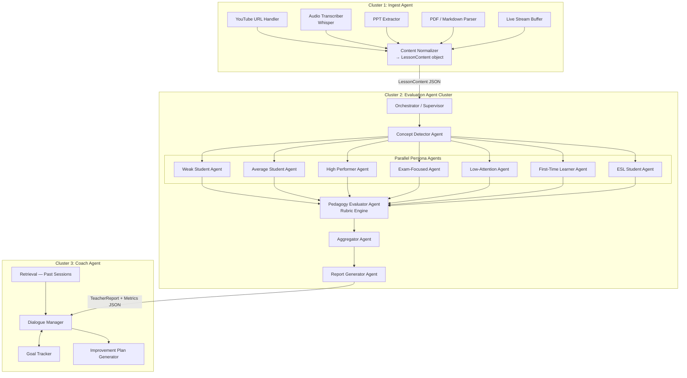

# Multi-Agent Architecture: Teacher Feedback System

## The Core Realization

This system is NOT one agent. It's **three distinct agent clusters** with clear boundaries, each independently useful, deployable, and composable.

Trying to make this one agent would be like building one function that:
- Opens a file
- Parses it
- Runs a simulation
- Evaluates results
- Generates a report
- Emails it

Each of those is a separate responsibility. Same here.

---

## Why This Has to Be Multi-Agent

A single agent fails here for three structural reasons:

1. **Context window** — A 60-min video transcript is ~50,000 tokens. You can't fit the transcript + 7 persona simulations + rubric evaluation + report generation into one LLM call. Different stages need different context.

2. **Parallelism** — The 7 student persona simulations are completely independent of each other. A single agent runs them sequentially. A multi-agent system runs them in parallel — 7x faster.

3. **Specialization** — The agent that ingests a YouTube video has nothing to do with the agent that generates a coaching dialogue. Forcing them to share a model, prompts, and context is wasteful and error-prone.

---

## The Three Agent Clusters



---

## Cluster Breakdown

### Cluster 1 — Ingest Agent
**One job**: Accept any input format, normalize it to a `LessonContent` object.

```json
{
  "source_type": "youtube | audio | pptx | transcript | pdf | markdown | live",
  "segments": [
    {
      "id": "seg_001",
      "start_time": 0,
      "end_time": 120,
      "text": "Today we're going to cover...",
      "speaker": "teacher"
    }
  ],
  "metadata": {
    "duration_seconds": 3600,
    "subject": "optional",
    "grade_level": "optional"
  }
}
```

This agent is **totally independent**. It can be used by any other system that needs to ingest educational content. It has zero knowledge of evaluation or coaching.

**Can be deployed on skill.sh as:** `lesson-ingest-skill` — accepts a URL or file, returns a normalized transcript JSON.

---

### Cluster 2 — Evaluation Agent Cluster
**One job**: Accept a `LessonContent` object, return a `TeacherReport` + `PedagogyMetrics`.

This is where the LangGraph `StateGraph` lives. It's the most complex cluster.

**The Supervisor pattern:**
```
Orchestrator looks at the lesson content → decides which persona agents are relevant
→ fans out to all 7 personas in parallel
→ collects results
→ passes to Pedagogy Evaluator
→ passes to Aggregator
→ passes to Report Generator
→ runs Validation pass (the ClassMind lesson: validate after generate)
→ returns final report
```

**Each Persona Agent is a sub-agent:**
- Has its own system prompt (defining the student character)
- Has its own output schema
- Runs independently
- Can be overridden or customized without touching other agents

**Can be deployed on skill.sh as:** `lesson-evaluate-skill` — the core evaluation pipeline.

---

### Cluster 3 — Coach Agent
**One job**: Given a `TeacherReport`, engage in an ongoing coaching dialogue with the teacher.

This is where ClassMind **stopped** and where we go further. The report is static. The Coach Agent makes it interactive.

```
Teacher: "I don't understand why you said my pacing was off in minute 23"
Coach Agent: [retrieves segment, re-explains with evidence, offers alternative approaches]

Teacher: "What should I do differently next time for ESL students?"
Coach Agent: [references ESL persona findings, generates concrete lesson modifications]

Teacher: "Can you track if I improve on this next week?"
Coach Agent: [creates a goal, stores it, compares against next session's report]
```

The Coach Agent is a **long-lived, stateful agent** — it remembers across sessions, tracks improvement over time, and adjusts its depth based on teacher experience level (the ClassMind lesson: novice vs. veteran need different coaching).

**Can be deployed on skill.sh as:** `teacher-coach-skill` — a conversational coaching agent with memory.

---

## Data Contracts (What Flows Between Clusters)

```
[Any Input] → Ingest Agent → LessonContent JSON
                                      ↓
                          Evaluation Cluster
                                      ↓
                        TeacherReport + PedagogyMetrics JSON
                                      ↓
                            Coach Agent (stateful)
                                      ↕
                           Ongoing teacher dialogue
```

These are strict Pydantic schemas. Any cluster can be swapped, upgraded, or replaced as long as it respects the schema. This is the key to composability.

---

## How This Maps to skill.sh

You can publish **3 independent skills** + **1 composed pipeline**:

| Skill Name | What It Does | Input | Output |
|---|---|---|---|
| `lesson-ingest` | Normalize any lesson format | URL / File / Text | `LessonContent` JSON |
| `lesson-evaluate` | Run full pedagogical evaluation | `LessonContent` JSON | `TeacherReport` + `PedagogyMetrics` |
| `teacher-coach` | Interactive coaching dialogue | `TeacherReport` + conversation | Coaching response + goal tracking |
| `teacher-feedback-pipeline` | All 3 chained together | URL / File / Text | Full pipeline execution |

This is the power of the multi-agent design: each skill is **independently discoverable, testable, and composable**. Someone building a different EdTech tool could reuse just the `lesson-ingest` skill, for example.

---

## What Changes in Our Implementation Plan

### Input Stage — Ingest Agent gets its own service

Instead of a simple module inside the backend, the Ingest Agent becomes a **FastAPI microservice** (or a LangGraph subgraph with its own endpoints):

- `POST /ingest/youtube` — URL → `LessonContent`
- `POST /ingest/audio` — file → Whisper → `LessonContent`
- `POST /ingest/pptx` — file → `LessonContent`
- `POST /ingest/transcript` — raw text → `LessonContent`
- `WS /ingest/live` — WebSocket for streaming classroom feed

Each handler is independently testable and deployable.

### Evaluation Stage — Persona Agents run in parallel

In LangGraph, we use a **fan-out pattern**:

```python
# In the LangGraph graph builder
builder.add_node("orchestrator", orchestrator_node)
builder.add_node("persona_weak", persona_agent("weak_student"))
builder.add_node("persona_average", persona_agent("average_student"))
# ... etc for all 7

# Fan-out from orchestrator to all personas
for persona in PERSONAS:
    builder.add_edge("orchestrator", f"persona_{persona}")

# Fan-in: all personas must complete before aggregation
builder.add_edge([f"persona_{p}" for p in PERSONAS], "pedagogy_evaluator")
```

This makes persona simulation **~7x faster** vs. sequential.

### Output Stage — Coach Agent is a separate long-lived service

The Coach Agent needs:
- **Persistent memory** — stores past session reports, teacher goals, improvement tracking
- **Conversational state** — manages multi-turn dialogue
- **Retrieval** — searches past reports when teacher asks about historical trends
- **pgvector** — embeds report chunks for semantic retrieval

This can't live in the same request lifecycle as the evaluation pipeline. It's a **persistent service** with its own database schema:

```sql
CREATE TABLE coaching_sessions (
    id UUID PRIMARY KEY,
    teacher_id UUID,
    evaluation_id UUID REFERENCES evaluations(id),
    messages JSONB,  -- conversation history
    goals JSONB,     -- improvement goals
    created_at TIMESTAMP,
    updated_at TIMESTAMP
);
```

---

## The Right Mental Model

Think of it like a hospital:

- **Ingest Agent** = Triage / Intake (gets the patient info in a standardized format)
- **Evaluation Cluster** = Diagnostic team (multiple specialists working in parallel, generating a report)
- **Coach Agent** = Ongoing GP / therapist (uses the diagnostic report for long-term care)

Each team has its own expertise, tools, and schedule. They share information through structured handoffs (the medical record = our JSON schemas). You wouldn't hire one person to do all three jobs.

---

## Summary

| Question | Answer |
|---|---|
| Is this one agent? | No. It's 3 agent clusters with distinct responsibilities. |
| Can it be on skill.sh? | Yes — as 3 independent skills + 1 composed pipeline. |
| What's the input architecture? | A dedicated Ingest Agent with handlers per modality, outputting a unified `LessonContent` JSON. |
| What's the output architecture? | A stateful Coach Agent that takes the `TeacherReport` and opens an ongoing dialogue, with memory across sessions. |
| What's the key benefit of this split? | Parallelism (7 persona agents simultaneously), composability (each skill independently useful), scalability (each cluster can be scaled independently based on load). |
