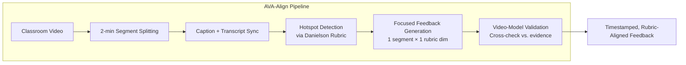

# ClassMind Paper Analysis
## *"Scaling Classroom Observation and Instructional Feedback with Multimodal AI"*

**Authors:** MIT, MSU, Johns Hopkins — Published Sept 2025, arXiv:2509.18020v1

---

## What They Built

ClassMind is an **AI-powered classroom observation system** that ingests full-length classroom video recordings and generates rubric-aligned instructional feedback for teachers. At its core is **AVA-Align** (Adaptive Video Agent with Alignment), a novel agent framework for long-video understanding.

---

## What They Did — Research Methodology (3 Phases)

### Phase 1: Formative Studies (Understanding the Problem)

| Study | Scale | Key Findings |
|---|---|---|
| **Narrative review** of education literature | Broad | 3 pillars: feedback must be (1) standards-aligned, (2) specific & actionable, (3) delivered in a supportive tone |
| **Online survey** of PK-12 teachers | N=75 | 92% use AI already; 72% want AI for lesson plan feedback; **68% cite privacy as top concern**; 83% want written reports |
| **Expert interviews** with teachers & coaches | N=6 | Human coaches observe "just 5 minutes"; AI excels at analytics but "90% of coaching is trust-building outside sessions" |

### Phase 2: System Design & Implementation

From formative work, they derived **5 design goals**:

1. **DG1**: Anchor feedback in established frameworks (Danielson, CLASS)
2. **DG2**: Use supportive, strengths-first tone
3. **DG3**: Deliver specific, immediately actionable recommendations
4. **DG4**: Link feedback to video timestamps for efficient navigation
5. **DG5**: Analyze full-length videos, not just fragments

### Phase 3: User Study (Simulated Role-Play)

- N=6 secondary teachers, recruited via Prolific
- Used ATLAS video library (National Board Certified Teacher videos, 10-15 min)
- Teachers role-played as if the feedback was about their own teaching
- Measured with USE (usability), NASA-TLX (workload), FATE (responsible AI)

---

## What Worked — Key Technical Wins

### 1. AVA-Align Outperformed Baselines

Benchmarked against Gemini-2.5-Pro (direct) and Deep Video Discovery on 10 ATLAS videos:

| Metric | What it measures | AVA-Align advantage |
|---|---|---|
| **Reliability/Factuality** | Is the feedback grounded in actual video events? | Higher factuality than both baselines |
| **Usefulness (Significance + Feasibility)** | Is the feedback pedagogically meaningful and actionable? | More meaningful insights |
| **Temporal Coverage** | Is feedback spread across the lesson or clustered? | More balanced distribution across full lesson |

### 2. Strong Module-Level Performance

| Module | Metric | Score |
|---|---|---|
| Teacher Question Detection & Classification | F1 | **0.964** |
| Teacher Question Detection & Classification | Precision | **1.0** |
| Activity Annotation (teacher activities) | Micro-F1 | **0.89** |
| Activity Annotation (student activities) | Micro-F1 | **0.78** |
| Speaker Diarization | Jaccard Error Rate | **10.3%** |

### 3. Key Architectural Decisions That Paid Off

> [!TIP]
> **These are directly applicable to our system:**

- **2-minute segment windowing** — balances context window limits with temporal accuracy. They found this is the sweet spot for Gemini-2.5-Flash.
- **Hotspot-first, then deep-dive** — instead of evaluating everything, first identify "interesting" segments per rubric dimension, then zoom in. Reduces hallucination and cost.
- **One segment × one rubric dimension** — focusing the LLM's attention on a single evaluation dimension at a time dramatically improves instruction following.
- **Validation > Generation** — a separate pass where the model validates its own feedback against video evidence. Research shows LLMs are more reliable at verification than generation.
- **Rubric grounding** — free-form feedback from LLMs was inconsistent. Anchoring generation in structured rubrics (Danielson Framework) made outputs more reliable and aligned.

### 4. User Study Results — What Teachers Valued

| Measure | Score | Interpretation |
|---|---|---|
| **Usability (USE)** | 5.9/7 | Highly usable; "figured it out within minutes" |
| **Workload (NASA-TLX)** | 28.5/100 | Low burden; effort was in *reflection*, not navigation |
| **Responsible AI (FATE)** | 5.8/7 | Fair, causable; weaker on accountability & explainability |

**Qualitative highlights:**
- Bloom's taxonomy distribution was the **single most compelling feature** — it acted as a "mirror" showing gaps between what teachers *thought* they were doing and reality
- Teachers trusted the system most when it confirmed things they had already noticed ("that's the student! … the system picked it up")
- The system moved teachers from **vague impressions to articulated reflections** — a math teacher said the AI caught an imprecise use of a mathematical term that a district-level science supervisor would never have noticed
- AI was perceived as a **"safe layer of objectivity"** — easier to accept than feedback from a supervisor with authority dynamics

---

## What Didn't Work / Tensions Discovered

### 1. Cognitive Overload from Comprehensive Feedback

> [!WARNING]
> This is the #1 usability issue they discovered.

Teachers felt overwhelmed by the volume of feedback. One teacher said *"Oh my God, that's so long. I don't wanna see it."* Another felt "validated by positive recognition, then discouraged by a long list of improvements."

**Implication for us**: We need **progressive disclosure** — summary first, expandable details on demand. Our persona-based approach could help here: surface the "consensus" issues first, let users drill into per-persona views.

### 2. Nitpicky False Positives

A dropped marker was flagged as a "classroom management issue." This eroded trust. Teachers adopted a **curation mindset** ("use what you need, discard the rest"), but the burden of curation itself is a problem.

**Implication for us**: Our confidence scoring system must have a meaningful threshold. Low-confidence findings should be suppressed by default.

### 3. Framework Unfamiliarity

One teacher didn't understand the Danielson domain labels despite agreeing with the substance of the feedback. Professional jargon created an accessibility barrier.

**Implication for us**: Use plain language by default, with optional framework/jargon mapping for experts.

### 4. Transcript Degradation in Multi-Speaker Discussion

ASR quality dropped during group discussions with overlapping speakers. This is a hard technical problem that limited the system's ability to analyze student-heavy segments.

### 5. Novice vs. Veteran Divergence

| Dimension | Novice Teachers | Veteran Teachers |
|---|---|---|
| **Tone preference** | Gentle, supportive, brief | Critical, comprehensive, challenging |
| **Top need** | Actionable tips for the *next class* | Deep critique to challenge entrenched habits |
| **Feedback volume** | Less is more; 1-2 sentence takeaways | More is better; full domain coverage |
| **Current priority** | Lesson content & planning (not observation) | Reflective practice & professional growth |

**Implication for us**: This directly validates our multi-persona approach. But we should also consider **adaptive framing of the output** based on the teacher's experience level (a "teacher persona" for the output, not just student personas for the analysis).

---

## Their Limitations (Explicitly Stated)

### 1. No Real Classroom Deployment
Teachers watched *other people's* videos in a role-play scenario. They didn't analyze their own teaching. This means:
- Context-setting features weren't tested
- Emotional investment was simulated, not real
- The "privacy concern" responses were hypothetical

### 2. Static One-Way Feedback Only
No interactive coaching dialogue. Teachers wanted back-and-forth conversation — "collaborative planning and iterative feedback exchange." The system is a report generator, not a coaching partner.

### 3. No Content/Subject-Matter Expertise
The system evaluates *instructional technique* (pacing, questioning, engagement) but not *content accuracy*. A math teacher noted that coaches often lack subject knowledge — AI could fill this gap but ClassMind doesn't try.

### 4. Small Sample Size
N=6 for user study, N=75 for survey. Results are exploratory, not generalizable.

### 5. ATLAS Videos are Short (10-15 min)
Real classes are 45-90 minutes. The 2-minute segmentation approach hasn't been stress-tested on truly long sessions.

---

## Their Future Scope

1. **School partnerships for in-situ deployment** — real teachers, real classrooms, their own videos
2. **Interactive coaching** — conversational AI that supports reflective dialogue and collaborative goal-setting
3. **Content-specific feedback** — integrating subject-matter knowledge with instructional analysis
4. **Longitudinal tracking** — teacher development over time, across multiple lessons
5. **Customizable rubrics** — beyond Danielson to school-specific or national standards

---

## What We Can Learn for Our Teacher Feedback Agent

### Validated Design Decisions (Adopt)

| ClassMind Finding | Our System Equivalent | Action |
|---|---|---|
| Rubric-grounded evaluation prevents hallucination | Our rubric engine | ✅ Already planned — this is strongly validated |
| 2-min segment windowing for video | Our lesson segmenter | ✅ Adopt same approach for audio/video inputs |
| Hotspot → deep-dive pipeline | Our concept detector → pedagogy evaluator flow | ✅ Structurally similar — validated |
| Validation pass after generation | Not yet planned | ⚠️ **Add a validation node** to our LangGraph pipeline |
| Bloom's taxonomy was the "killer feature" | Our Bloom distribution analysis | ✅ Prioritize this in the UI — it's what teachers love most |
| Strengths-first, then weaknesses, then advice | Our report generator | ✅ Match this exact ordering in output |
| Evidence spans for every claim | Our evidence_spans requirement | ✅ Strongly validated — this is what builds trust |

### New Ideas to Adopt (Not in Our Current Plan)

| Insight | Integration into Our System |
|---|---|
| **Progressive disclosure** to manage cognitive overload | Add summary view → expandable detail view in dashboard. Default to top-3 findings. |
| **Adaptive framing** by teacher experience level | Add a `teacher_profile` input (novice/intermediate/veteran) that adjusts tone, verbosity, and focus |
| **COPUS activity codes** for time distribution | Add activity annotation as an objective output alongside our pedagogical evaluation |
| **"Safe objectivity" framing** | Position our system as a reflective partner, not an evaluator. This matters for adoption. |
| **Validation node** in the pipeline | Add a `validator` node after `report_generator` that cross-checks each finding against source evidence |
| **Timestamp-linked navigation** | Essential for our confusion heatmap — link every finding to a source segment ID with jump-to functionality |

### Gaps in ClassMind That We Fill

| ClassMind Gap | Our System's Advantage |
|---|---|
| No student perspective simulation | **Our core differentiator** — 7 student personas |
| No cognitive load measurement | We explicitly score cognitive load per segment |
| No scaffolding gap detection | Our concept detector builds a prerequisite graph |
| No retrieval practice detection | We score retrieval usage as a rubric dimension |
| Single evaluation framework (Danielson only) | We combine multiple learning science dimensions |
| No simulated student questions | We generate probable student confusions and questions |
| No misconception prediction | We predict likely misconceptions per persona |
| Text-only output | We produce structured JSON metrics alongside narrative |
| No audio/vocal analysis | Our roadmap includes pitch, pace, filler word analysis |

### Warnings from Their Experience

> [!CAUTION]
> **Things to get right or risk failure:**

1. **Privacy is the #1 adoption blocker** — 68% of surveyed teachers cited this. We must have a clear data handling policy from day 1.
2. **Don't frame as evaluation/judgment** — teachers welcome AI as a "reflective partner" but resist it as an "administrative judgment tool." Our positioning matters.
3. **Feedback volume must be controllable** — overwhelming feedback destroys trust. Default to concise, allow expansion.
4. **Avoid nitpicky false positives** — a dropped marker flagged as "classroom management" eroded trust. Our confidence thresholds must be meaningful.
5. **Framework jargon is a barrier** — use plain language by default, framework labels as optional annotations.

---

## Summary Assessment

ClassMind is the closest published system to what we're building, and it comes from MIT — so it's a strong signal of what's viable and what's been validated. The key takeaway is:

**Their approach (rubric-grounded, segment-windowed, validation-checked feedback) works.** The technical architecture is sound and the user response is positive. But they stopped at *instructional observation* — they don't simulate student perspectives, detect scaffolding gaps, measure cognitive load, or predict misconceptions. These are exactly the dimensions where our system adds value.

The most important lesson is not technical — it's about **framing and tone**. The difference between a system teachers adopt and one they reject is whether it feels like a supportive mirror or a judgmental audit.
